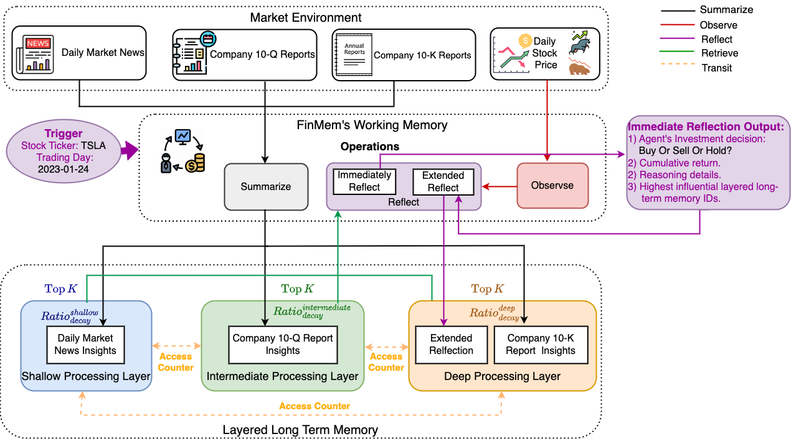
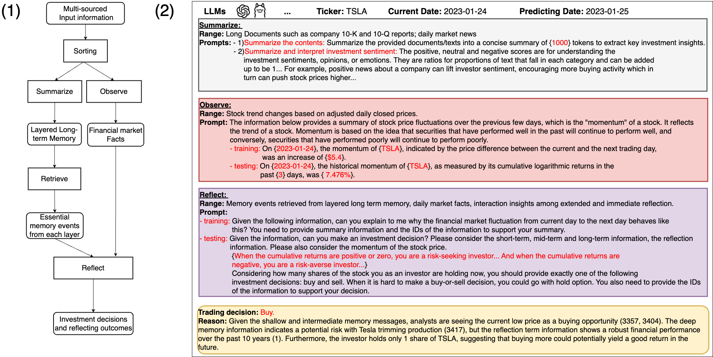
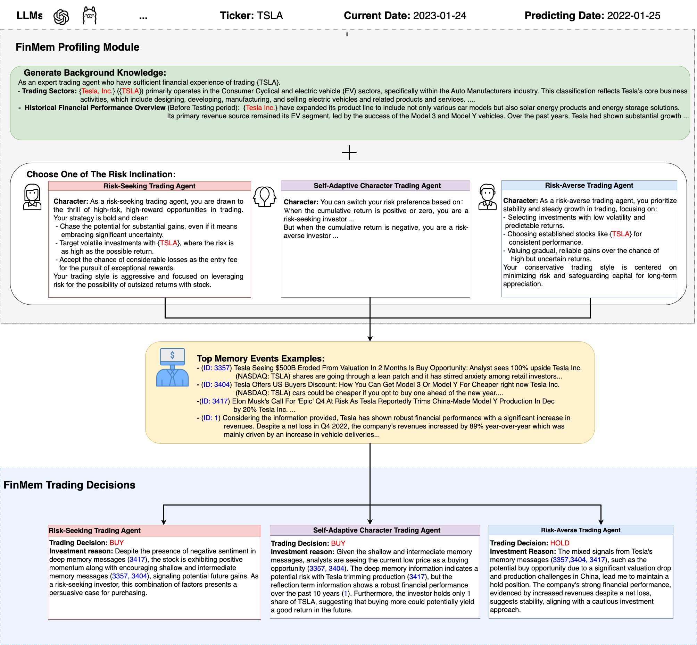

# FINMEM: A Performance-Enhanced LLM Trading Agent with Layered Memory and Character Design

[](https://www.python.org/downloads/release/python-3100/) [](https://opensource.org/licenses/MIT) [](https://github.com/ambv/black) [](https://arxiv.org/abs/2311.13743)

```text
"So we beat on, boats against the current, borne back ceaselessly into the past."
                                        -- F. Scott Fitzgerald: The Great Gatsby
```

This repo provides the Python source code for the paper:
[FINMEM: A Performance-Enhanced Large Language Model Trading Agent with Layered Memory and Character Design](https://arxiv.org/abs/2311.13743) [[PDF]](https://arxiv.org/pdf/2311.13743.pdf)

```bibtex
@misc{yu2023finmem,
      title={FinMem: A Performance-Enhanced LLM Trading Agent with Layered Memory and Character Design}, 
      author={Yangyang Yu and Haohang Li and Zhi Chen and Yuechen Jiang and Yang Li and Denghui Zhang and Rong Liu and Jordan W. Suchow and Khaldoun Khashanah},
      year={2023},
      eprint={2311.13743},
      archivePrefix={arXiv},
      primaryClass={q-fin.CP}
}
```
**📢 Update (Date: 01-16-2024)**

🚀 We're excited to share that our work, "FINMEM: A Performance-Enhanced LLM Trading Agent with Layered Memory and Character Design," has been selected for an extended abstract at the AAAI Spring Symposium on Human-Like Learning!

**📢 Update (Date: 03-11-2024)**

🚀 We're thrilled to announce that our paper, "FINMEM: A Performance-Enhanced LLM Trading Agent with Layered Memory and Character Design", has been accepted by ICLR Workshop LLM Agents!

**📢 Update (Date: 06-16-2024)**

🎉 Thank you to all the participants and organizers of the IJCAI2024 challenge, "Financial Challenges in Large Language Models - FinLLM". Our team, FinMem, was thrilled to contribute to Task 3: Single Stock Trading.

As the challenge wrapped up yesterday (06/15/2024), we reflect on the innovative approaches and insights gained throughout this journey. A total of 12 teams participated, each bringing unique perspectives and solutions to the forefront of financial AI and Large Language Models.

We invite the community to continue engaging with us as we look forward to further developments and collaborations in this exciting field.


Recent advancements in Large Language Models (LLMs) have exhibited notable efficacy in question-answering (QA) tasks across diverse domains. Their prowess in integrating extensive web knowledge has fueled interest in developing LLM-based autonomous agents. While LLMs are efficient in decoding human instructions and deriving solutions by holistically processing historical inputs, transitioning to purpose-driven agents requires a supplementary rational architecture to process multi-source information, establish reasoning chains, and prioritize critical tasks. Addressing this, we introduce FinMem, a novel LLM-based agent framework devised for financial decision-making, encompassing three core modules: Profiling, to outline the agent's characteristics; Memory, with layered processing, to aid the agent in assimilating realistic hierarchical financial data; and Decision-making, to convert insights gained from memories into investment decisions. Notably, FinMem's memory module aligns closely with the cognitive structure of human traders, offering robust interpretability and real-time tuning. Its adjustable cognitive span allows for the retention of critical information beyond human perceptual limits, thereby enhancing trading outcomes. This framework enables the agent to self-evolve its professional knowledge, react agilely to new investment cues, and continuously refine trading decisions in the volatile financial environment. We first compare FinMem with various algorithmic agents on a scalable real-world financial dataset, underscoring its leading trading performance in stocks and funds. We then fine-tuned the agent's perceptual spans to achieve a significant trading performance. Collectively, FinMem presents a cutting-edge LLM agent framework for automated trading, boosting cumulative investment returns.





## Repository Structure

```bash
finmem-docker
├── LICENSE
├── README.md
├── config  -> Configurations for the program
├── data  -> Data
├── puppy  -> Source code
├── run.py  -> Entry point of the program, see below for details
├── run_examples.sh  -> Bash cmd for build the docker image and run the docker container
```


## Usage

### Setting Environment Variables & Configurations for Different Models

The model can be run with LLMs on HuggingFace that can be deployed via [TGI](https://github.com/huggingface/text-generation-inference) and has sufficient instruction following ability. As we will always use the `text-embedding-ada-002` as our embedding model, the `OPENAI_API_KEY` variable needs to be set in `.env` no matter what backbone LLM is used.

If the LLM is gated, the `HF_TOKEN` needs to be set in `.env`

```bash
OPENAI_API_KEY = "<Your OpenAI Key>"
HF_TOKEN = "<Your HF token>"
```

and set the `config/config.toml`

```bash
[chat]
model = "tgi"
end_point = "<set the your endpoint address>"
tokenization_model_name = "<model name>"
...
```

To run the OpenAI model, the configuration file should be set as

```bash
model = "gpt-4"
end_point = "https://api.openai.com/v1/chat/completions"
tokenization_model_name = "gpt-4"
```

and with comment out `HF_TOKEN` in `.env`

```bash
OPENAI_API_KEY = "<Your OpenAI Key>"
# HF_TOKEN = ""
```

### Build Docker Image & Run the Container

The dockerfile is based on Python 3.10 at

```bash
.devcontainer/Dockerfile
```

To build the docker image, run

```bash
docker build -t test-finmem finmem/.devcontainer/. 
```

To start the container, run

```bash
docker run -it --rm -v $(pwd):/finmem test-finmem bash
```

This will enter the root folder of the project.

## Program

The program has two main functionalities:

```bash
 Usage: run.py sim [OPTIONS]                                                                                                                
                                                                                                                                            
 Start Simulation                                                                                                                           
                                                                                                                                            
╭─ Options ────────────────────────────────────────────────────────────────────────────────────────────────────────────────────────────────╮
│ --market-data-path    -mdp      TEXT  The environment data pickle path [default: data/06_input/subset_symbols.pkl]                       │
│ --start-time          -st       TEXT  The training or test start time [default: 2022-06-30 For Ticker 'TSLA']                                                               │
│ --end-time            -et       TEXT  The training or test end time [default: 2022-10-11]                                                                 │
│ --run-model           -rm       TEXT  Run mode: train or test [default: train]                                                           │
│ --config-path         -cp       TEXT  config file path [default: config/config.toml]                                                     │
│ --checkpoint-path     -ckp      TEXT  The checkpoint save path [default: data/10_checkpoint_test]                                             │
│ --result-path         -rp       TEXT  The result save path [default: data/11_train_result]                                               │
│ --trained-agent-path  -tap      TEXT  Only used in test mode, the path of trained agent [default: None. Can be changed to data/05_train_model_output OR data/06_train_checkpoint]                                  │
│ --help                                Show this message and exit.                                                                        │
╰──────────────────────────────────────────────────────────────────────────────────────────────────────────────────────────────────────────╯
                              
```

Notice our model has two modes: `train` and `test`. In the train mode, the information populate the agent's memory. In the test mode, the agent will use the information in the memory and new information to make decisions. When `test` mode is selected, the trained agent must be provided.

When the program stopped due to exceptions(OpenAI API is not stable, etc.), the training/testing process can be resumed with

```bash
                                                                                                                                            
 Usage: run.py sim-checkpoint [OPTIONS]                                                                                                     
                                                                                                                                            
 Start Simulation from checkpoint                                                                                                           
                                                                                                                                            
╭─ Options ────────────────────────────────────────────────────────────────────────────────────────────────────────────────────────────────╮
│ --checkpoint-path  -cp      TEXT  The checkpoint path [default: data/06_train_checkpoint]                                                │
│ --result-path      -rp      TEXT  The result save path [default: data/05_train_model_output]                                             │
│ --config-path      -ckp      TEXT  config file path [default: config/tsla_config.toml]                                                    │
│ --run-model        -rm      TEXT  Run mode: train or test [default: train]                                                               │
│ --help                            Show this message and exit.                                                                            │
╰──────────────────────────────────────────────────────────────────────────────────────────────────────────────────────────────────────────╯
```
## Star History

[](https://star-history.com/#pipiku915/FinMem-LLM-StockTrading&Date)
